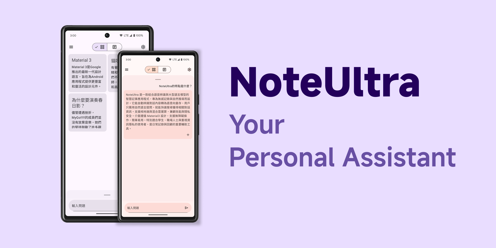

# NoteUltra

#### NoteUltra is an open-source, privacy-first personal assistant that aims to help you capture and organize information in your daily life in an intuitive way.

## Features
* **Effortless**: You no longer need to write everything down. NoteUltra listens to audio from around you and transcribes it to text actively.  
* **Intuitive**: Simply ask questions to AI. No more searching, no more guessing.  
* **Privacy first**: All the data is secured locally on your device, and all the data can be processed on the device.  
* **Your assistant, Your choices**: NoteUltra provides a wide variety of customizations, including prompts for LLM and the models of LLM. NoteUltra even provides a standard API that allows you to use your own self-hosted LLM inference server.  
* **Material You**: NoteUltra uses Material 3 design from Google. It provides an accessible and personalized experience.

## Requirement:
OS: Android 13+  
RAM: 2GB+(12GB recommended for on-device inferencing.)  
CPU: Snapdragon 855+  

## How to use my own LLM model?
To reduce package size, NoteUltra does not include the LLM model by default. You can download the Gemma 2B model from Kaggle or any other model in TFLite format. Currently, the app can only read models from /tmp. You may need MT File Manager or Android Studio file explorer to access this directory.
You may also host your own LLM inference node by following the documentation [here](https://github.com/PL7963/NoteUltra/wiki/Remote-Inference-server).

## Special Thanks to: 
NoteUltra wouldn't be possible without these open-sourced projects.  
[MediaPipe by Google](https://github.com/google-ai-edge/mediapipe)  
[ObjectBox by ObjectBox](https://github.com/objectbox/objectbox-java)   
[AndroidX by Google](https://github.com/androidx/androidx)  
[kotlinx-serialization by Kotlin](https://github.com/Kotlin/kotlinx.serialization)  
[sherpa-ncnn by k2-fsa](https://github.com/k2-fsa/sherpa-ncnn)  
[ncnn by Tencent](https://github.com/tencent/ncnn)  
[Material Design by Google](https://m3.material.io/)  
[OkHttp by Square](https://github.com/square/okhttp)  
[Kotlin by JetBrains](https://kotlinlang.org/)  
[Room by Google](https://github.com/androidx-releases/room/releases)
